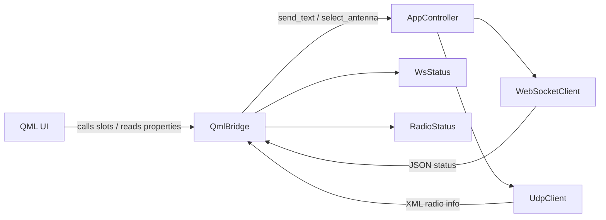

# Remote Switch (Qt)

## Build

Use the build scripts in the scripts folder. They create version.txt so the app can show a git-based version string.

If you run PyInstaller manually, create version.txt in the project root (short git hash) or set APP_GIT_COMMIT before building.

## Architecture

### Main classes

- `AppController` in [src/core/app_controller.py](src/core/app_controller.py) owns the WebSocket and UDP clients, wires callbacks, and exposes `start()`, `stop()`, and `send_text()`.
- `QmlBridge` in [src/ui/qml_bridge.py](src/ui/qml_bridge.py) is the main UI bridge, exposing properties, signals, and slots used by QML.
- `WebSocketClient` in [src/net/websocket_client.py](src/net/websocket_client.py) manages the WebSocket connection and event hooks.
- `UdpClient` in [src/net/udp_client.py](src/net/udp_client.py) listens for UDP radio info frames.
- `WsStatus` in [src/ui/ws_status.py](src/ui/ws_status.py) stores device state parsed from WebSocket JSON.
- `RadioStatus` in [src/ui/radio_status.py](src/ui/radio_status.py) stores rig frequency info parsed from UDP XML.
- `AppState` in [src/core/state.py](src/core/state.py) keeps basic runtime state shared by the controller.

### Busy flag handling

- `QmlBridge.busy` is set to true before sending a command and reset on WebSocket response or error paths.
- The flag is cleared in `_handle_ws_message`, `_handle_ws_error`, `_handle_ws_disconnected`, and `_handle_ws_send_failed` in [src/ui/qml_bridge.py](src/ui/qml_bridge.py).
- QML uses `bridge.busy` to disable antenna buttons and avoid overlapping commands (see [src/ui/qml/Main.qml](src/ui/qml/Main.qml)).
