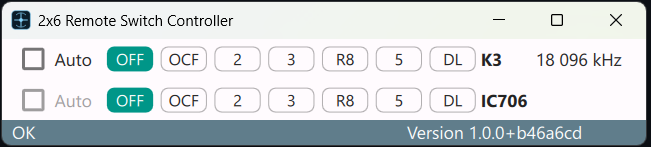
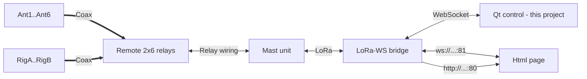
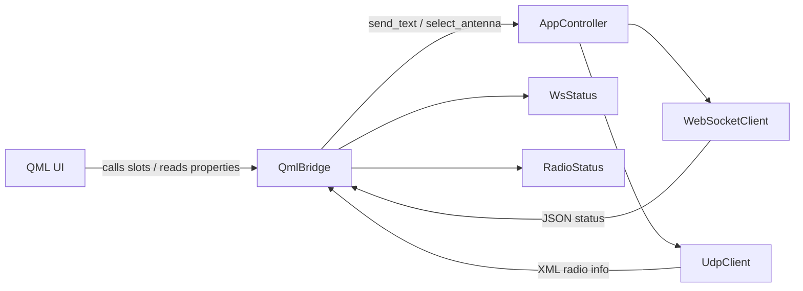

# Remote Switch (Qt)

## Build

Use the build scripts in the scripts folder. They create version.txt so the app can show a git-based version string.

If you run PyInstaller manually, create version.txt in the project root (short git hash) or set APP_GIT_COMMIT before building.

### Linux build from Windows

You can build the Linux bundle from Windows using WSL or Docker:

- WSL: `ui\scripts\build_linux.cmd` (default)
- Docker: `ui\scripts\build_linux.cmd docker`

Docker requires Docker Desktop running. Pull the image once: `docker pull python:3.11-slim`. The container installs `binutils` so PyInstaller has `objdump` available.

## Screenshot



## Config

The app reads settings from [config.json](config.json).

- `app.theme`: UI theme name (`light`, `dark`, or `system`). Uses Qt Material style.
- `wsConnection.url`: Base URL or host for the WebSocket/HTTP bridge.
- `wsConnection.port`: WebSocket port (default firmware uses 81).
- `wsConnection.autoReconnect`: Enable automatic reconnection after disconnect (default `true`).
- `wsConnection.reconnectIntervalMs`: Delay between reconnect attempts in ms (default `3000`).
- `wsConnection.maxReconnectAttempts`: Max reconnect tries; 0 = unlimited (default `0`).
- `wsConnection.heartbeatTimeoutMs`: Watchdog timeout in ms; 0 = disabled (default `7000`).
- `udpConnection.host`: Host to bind/connect for UDP radio info.
- `udpConnection.port`: UDP port for XML radio info frames.
- `rigs.rigAName`: Display name for Rig A.
- `rigs.rigBName`: Display name for Rig B.
- `antennas.ant0Name`: Display name for antenna 0 (OFF).
- `antennas.ant1Name`..`antennas.ant6Name`: Display names for antennas 1-6.
- `autoSwitch.antennaRules`: List of auto-switch rules (per rig and frequency range).
- `autoSwitch.antennaRules[].rig`: Target rig, `A` or `B`.
- `autoSwitch.antennaRules[].minFrequency`: Minimum frequency for the rule (kHz).
- `autoSwitch.antennaRules[].maxFrequency`: Maximum frequency for the rule (kHz).
- `autoSwitch.antennaRules[].primaryAntenna`: Antenna index to select first.
- `autoSwitch.antennaRules[].secondaryAntenna`: Fallback antenna index if primary is reserved by other rig.
- `logging.level`: Log level (e.g., `DEBUG`, `INFO`, `WARNING`).
- `logging.console`: Enable console logging output.
- `logging.file`: Log file path.

Example config:

```json
{
  "app": {
    "theme": "dark"
  },
  "wsConnection": {
    "url": "http://192.168.68.128/",
    "port": 81,
    "autoReconnect": true,
    "reconnectIntervalMs": 3000,
    "maxReconnectAttempts": 0,
    "heartbeatTimeoutMs": 7000
  },
  "udpConnection": {
    "host": "127.0.0.1",
    "port": 12060
  },
  "rigs": {
    "rigAName": "K3",
    "rigBName": "IC706"
  },
  "antennas": {
    "ant0Name": "OFF",
    "ant1Name": "OCF",
    "ant2Name": "R8",
    "ant3Name": "3",
    "ant4Name": "4",
    "ant5Name": "5",
    "ant6Name": "DL"
  },
  "autoSwitch": {
    "antennaRules": [
      {
        "rig": "A",
        "minFrequency": 100,
        "maxFrequency": 8000,
        "primaryAntenna": 1,
        "secondaryAntenna": 4
      },
      {
        "rig": "A",
        "minFrequency": 8000,
        "maxFrequency": 60000,
        "primaryAntenna": 4,
        "secondaryAntenna": 1
      },
      {
        "rig": "B",
        "minFrequency": 100,
        "maxFrequency": 8000,
        "primaryAntenna": 1,
        "secondaryAntenna": 4
      },
      {
        "rig": "B",
        "minFrequency": 8000,
        "maxFrequency": 60000,
        "primaryAntenna": 4,
        "secondaryAntenna": 1
      }
    ]
  },
  "logging": {
    "level": "DEBUG",
    "console": true,
    "file": "logs/app.log"
  }
}
```

## Hardware Architecture


- **Ant1..Ant6:** Six possible antennas (connected to relay unit).
- **RigA..RigB:** Two rigs (connected to relay unit).
- **Remote 2x6 relays:** Remote 2x6 antenna switch.
- **Mast unit:** Wisblock RAK11300 controller with galvanically isolated wiring through an I2C IO expander (MCP27016) to the relay unit; firmware uses the LoRaWan-Arduino library for LoRa P2P (not LoRaWAN).
- **LoRa-WS bridge:** Heltec V2 module with LoRa and WiFi radios; firmware uses RadioLib for LoRa, WebSocketsServer for the WS endpoint on port 81, and WebServer for the HTTP control page on port 80.
- **Qt control - this project:** Qt interface for selecting antennas; connects to the bridge over WebSocket on port 81.

## UI Architecture



### Main classes

- `AppController` in [src/core/app_controller.py](src/core/app_controller.py) owns the WebSocket and UDP clients, wires callbacks, and exposes `start()`, `stop()`, and `send_text()`.
- `QmlBridge` in [src/ui/qml_bridge.py](src/ui/qml_bridge.py) is the main UI bridge, exposing properties, signals, and slots used by QML.
- `WebSocketClient` in [src/net/websocket_client.py](src/net/websocket_client.py) manages the WebSocket connection and event hooks; includes automatic reconnection and heartbeat watchdog (see below).
- `UdpClient` in [src/net/udp_client.py](src/net/udp_client.py) listens for UDP radio info frames.

### WebSocket reconnect and heartbeat

The `WebSocketClient` automatically reconnects after a disconnect and detects stale connections using a heartbeat watchdog.

**Auto-reconnect:**
- When the WebSocket disconnects unexpectedly, the client waits `reconnect_interval_ms` (default 3000 ms) and attempts to reconnect.
- Reconnection continues until successful or `max_reconnect_attempts` is reached (0 = unlimited).
- Calling `close()` intentionally stops the reconnect loop.

**Heartbeat watchdog:**
- The bridge sends status messages every ~5 seconds. The client expects to receive a message within `heartbeat_timeout_ms` (default 7000 ms).
- If no message arrives in time, the client closes the socket and triggers reconnection.
- Set `heartbeat_timeout_ms` to 0 to disable the watchdog.

Configuration in `WebSocketConfig`:

| Parameter               | Default | Description                                      |
|-------------------------|---------|--------------------------------------------------|
| `auto_reconnect`        | `True`  | Enable automatic reconnection                    |
| `reconnect_interval_ms` | `3000`  | Delay between reconnect attempts (ms)            |
| `max_reconnect_attempts`| `0`     | Max reconnect tries; 0 = unlimited               |
| `heartbeat_timeout_ms`  | `7000`  | Watchdog timeout; 0 = disabled                   |
- `WsStatus` in [src/ui/ws_status.py](src/ui/ws_status.py) stores device state parsed from WebSocket JSON.
- `RadioStatus` in [src/ui/radio_status.py](src/ui/radio_status.py) stores rig frequency info parsed from UDP XML.
- `AppState` in [src/core/state.py](src/core/state.py) keeps basic runtime state shared by the controller.

### Busy flag handling

- `QmlBridge.busy` is set to true before sending a command and reset on WebSocket response or error paths.
- The flag is cleared in `_handle_ws_message`, `_handle_ws_error`, `_handle_ws_disconnected`, and `_handle_ws_send_failed` in [src/ui/qml_bridge.py](src/ui/qml_bridge.py).
- QML uses `bridge.busy` to disable antenna buttons and avoid overlapping commands (see [src/ui/qml/Main.qml](src/ui/qml/Main.qml)).

## Message Structures

### Radio info (received UDP message)

- See [N1MM+ Radio Info](https://n1mmwp.hamdocs.com/appendices/external-udp-broadcasts/#radio-info).
- Frequency and TxFrequency are converted to kHz on message receive.

### Antenna selection command (sent WS message)

- Fixed-length two-character message: first character denotes rig (A or B); second character denotes antenna number (1..6). All antennas off is denoted by `-` (a hyphen).

Example:
Switch A-rig to antenna 5
```ascii
A5
```

### Antenna info (received WS message)

- JSON message received after every sent command and periodically every 5 seconds.
- `a`: Rig `A` selected antenna number or `-` (a hyphen) if all antennas are off.
- `b`: Rig `B` as above.
- `cmds`: Mast unit last command status; if not `0` the last command failed.
- `i2cs`: Mast unit last command internal I2C status code; if not `0` the last command failed.
- `rssi`: Bridge unit LoRa signal strength (dBm).
- `snr`: Signal-to-noise ratio in the Mast unit for the Bridge-unit signal (dB).
- `lrssi`: Mast unit signal strength received in the Bridge-unit (dBm).
- `pwr`: Used LoRa transmitter power in Bridge and Mast units (dBm).

Example:

```json
{
  "a": "5",
  "b": "4",
  "cmds": 0,
  "i2cs": 0,
  "rssi": -37,
  "snr": 10,
  "lrssi": -60,
  "pwr": 2
}
```

- Rig A, connected to antenna 5
- Rig B, connected to antenna 4
- Last command OK
- Last I2C delivery OK
- Mast unit received LoRa signal -37 dBm; with S/N ratio 10 dB
- Bridge unit received Mast LoRa signal -60 dBm
- Used LoRa transmit power was 2 dBm


